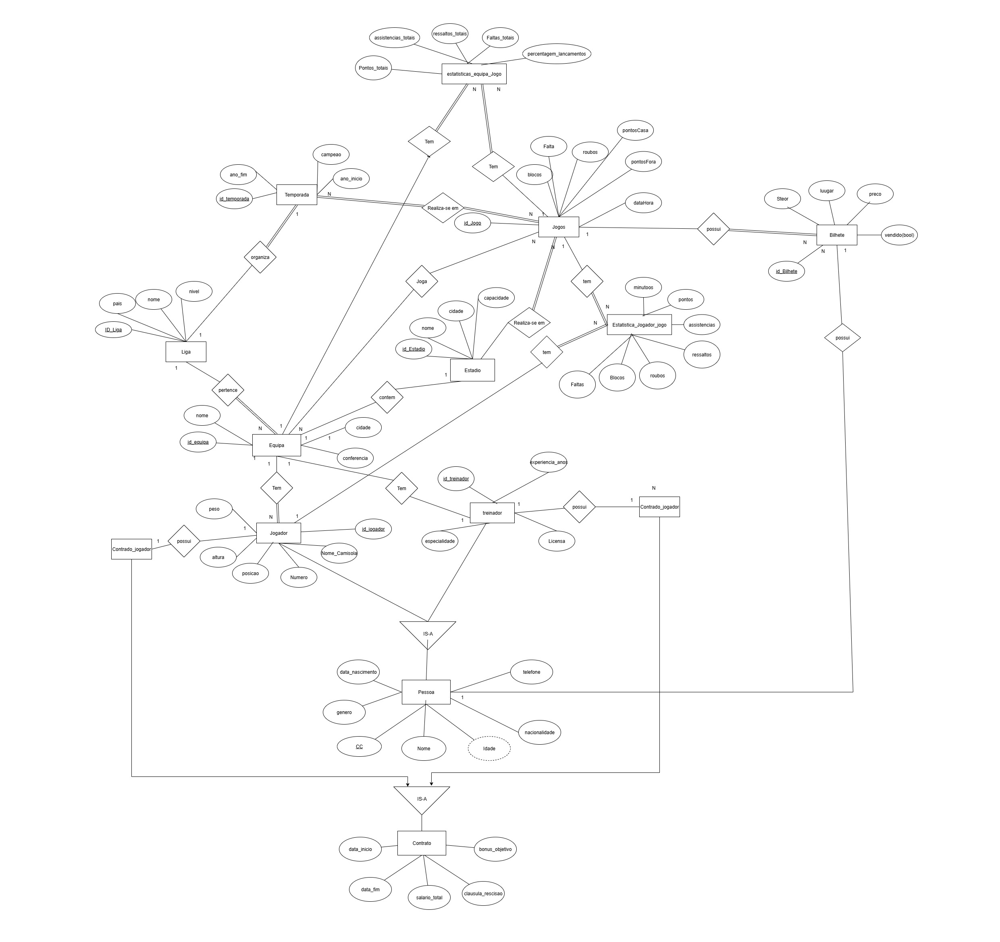
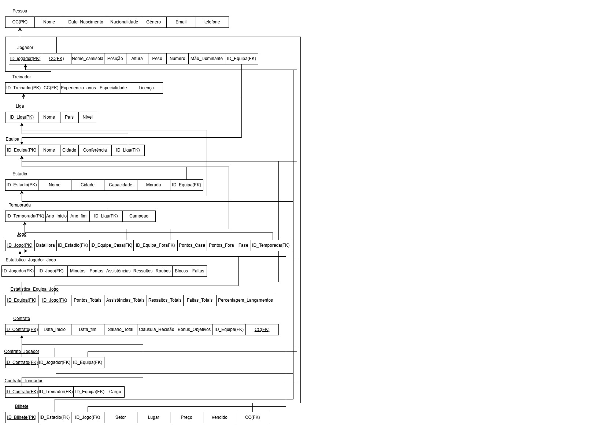
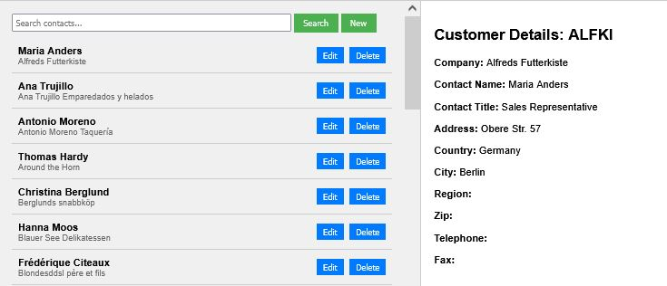

# BD: Trabalho Prático APF-T

**Grupo**: P4G4
- Kelvin Loforte, MEC: 121420
- Rómulo Monteiro, MEC: 127986

# Instructions - TO REMOVE

Este template é flexível.
É sugerido seguir a estrutura, links de ficheiros e imagens, mas adicione conteúdo sempre que achar necessário.

---

This template is flexible.
It is suggested to follow the structure, file links and images but add more content where necessary.

The files should be organized with the following nomenclature:

- sql\01_ddl.sql: mandatory for DDL
- sql\02_sp_functions.sql: mandatory for Store Procedure, Functions,... 
- sql\03_triggers.sql: mandatory for triggers
- sql\04_db_init.sql: scripts to init the database (i.e. inserts etc.)
- sql\05_any_other_matter.sql: any other scripts.

Por favor remova esta secção antes de submeter.

Please remove this section before submitting.

## Introdução / Introduction
O nosso projeto é uma base de dados sobre a Liga de Basquetebol NBA, que é a principal competição profissional de basquete do mundo.
O objetivo é de criar uma base de dados que armazene e organize informações sobre equipas, jogadores e estatísticas, permitindo gerar relatorios e consultas.

    Queremos que a base de dados possa responder a perguntas, tais como:
    . "Quais são os jogadores de cada equipa?"
    . "Quais foram os resultados de um determinado jogo?"
    . "Quem foi o campeão em cada temporada?"
    . "Quais são as estatisticas individuais dos jogadores e ou equipas?"
    . etc...

    Ou seja, o nosso foco é representar a estrutura e funcionamento da NBA de forma organizada e consultável.

## ​Análise de Requisitos / Requirements
##  . Requisitos funcionais
        1. Registar: 
            O sistema deve permitir o registo de:
                    - equipas da NBA(Nome,cidade,treinador princial, conferência e divisão)
                    - jogadores (Nome,posicao,nacionalidade,equipa atual, altura, peso, data de nascimento)
                    - jogos (equipas participantes (casa e fora) ,data, local, resultado (pontos casa/fora), temporada)
                    - temporadas (ano de início e fim, equipe campeã, total de jogos)
                    - contratos (jogador, equipa, datas de início e fim, salário)

        2. Guardar: 
            O sistema deve guardar:
                    - estatisticas dos jogadores por jogo (pontos, assistências, ressaltos, roubos, faltas, minutos jogados, eficiência)
                    - a relação entre jogadores e equipas (contratos)
                    - o resultado de cada jogo (pontuação final e vencedor)
                    - histórico de equipas em cada temporada: posição final, número de vitórias e derrotas.

        3. Consultar:
            O sistema deve permitir consultas como: 
                    - Top scorers da época (jogadores com mais pontos)
	                - Resultados de jogos entre duas equipas específicas.
	                - estatisticas médias por jogador (pontos, ressaltos, assistências, etc...)
                    - estatisticas gerais por equipa e temporada
                    - jogadores por nacionalidade, posição ou equipa.
                    - histórico de quipas campeãs por temporada
                    - Jogadores com mais assistências, ressaltos ou eficiência
                    - evolução estatístia de um jogador ao longo das temporadas.

        4. Atualizar:
            O sistema deve permitir atualizar:
                    - tranferências de jogadores (mudança de equipa)
                    - resultados de jogos e estatisticas
                    - contratos (renovação, fim de contrato)
        
        5. Eliminar:
            O sistema deve permitir remover:
                    - equipas, jogadores, jogos, ...
                    - contratos ou estatísticas desatualizadas.

##  . Requisitos não funcionais:
        - Os dados dever ser consistentes e fáceis de Consultar.
        - O modelo deve ser escalável, podendo crescer com novas temporadas ou equipas.    
        
## DER - Diagrama Entidade Relacionamento/Entity Relationship Diagram

### Versão final/Final version



### Melhorias/Improvements 

Descreva sumariamente as melhorias sobre a entrega anterior.
Describe briefly the improvements made since the previous delivery.

## ER - Esquema Relacional/Relational Schema

### Versão final/Final Version



### Melhorias/Improvements

Descreva sumariamente as melhorias sobre a entrega anterior.
Describe briefly the improvements made since the previous delivery.

## ​SQL DDL - Data Definition Language

[SQL DDL File](sql/01_ddl.sql "SQLFileQuestion")

## SQL DML - Data Manipulation Language

Uma secção por formulário.
A section for each form.

### Formulario exemplo/Example Form



```sql
-- Show data on the form
SELECT * FROM MY_TABLE ....;

-- Insert new element
INSERT INTO MY_TABLE ....;
```

...

## Normalização/Normalization

Descreva os passos utilizados para minimizar a duplicação de dados / redução de espaço.
Justifique as opções tomadas.
Describe the steps used to minimize data duplication / space reduction.
Justify the choices made.

## Índices/Indexes

Descreva os indices criados. Junte uma cópia do SQL de criação do indice.
Describe the indexes created. Attach a copy of the SQL to create the index.

```sql
-- Create an index to speed queries by XYZ in form A.
CREATE INDEX index_name ON table_name (column1, column2, ...);
```

## SQL Programming: Stored Procedures, Triggers, UDF

[SQL SPs and Functions File](sql/02_sp_functions.sql "SQLFileQuestion")

[SQL Triggers File](sql/03_triggers.sql "SQLFileQuestion")

## Outras notas/Other notes

### Dados iniciais da dabase de dados/Database init data

[SQL DB Init File](sql/04_db_init.sql "SQLFileQuestion")

### Apresentação

[Slides](slides.pdf "Sildes")

[Video](https://elearning.ua.pt/pluginfile.php/55992/mod_label/intro/VideoTrabalho2013.mp4)


 