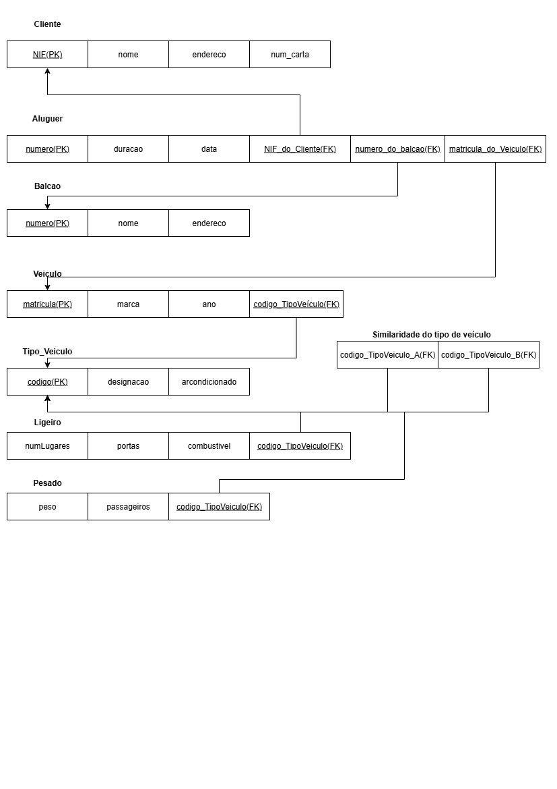
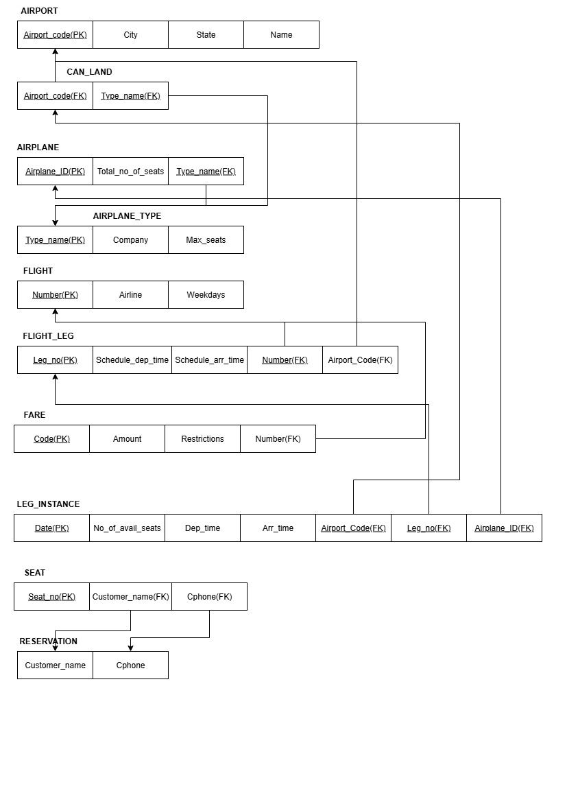
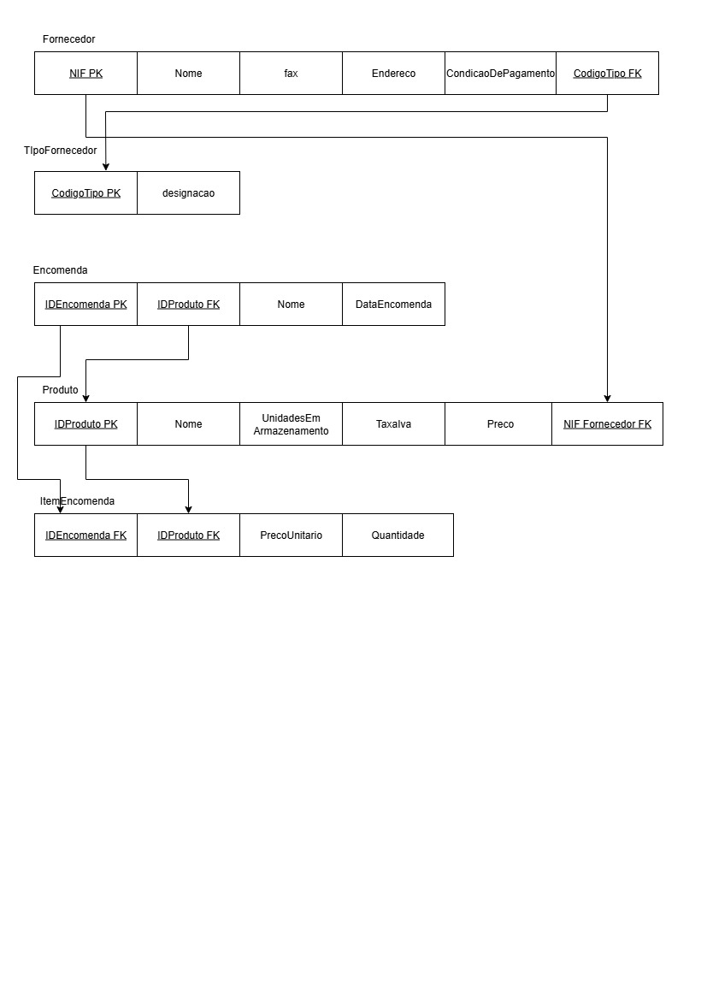
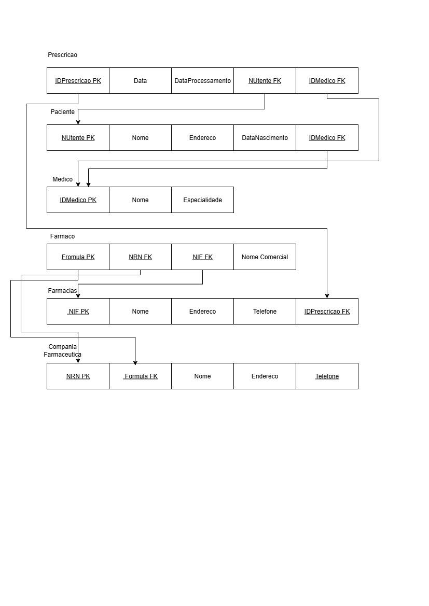
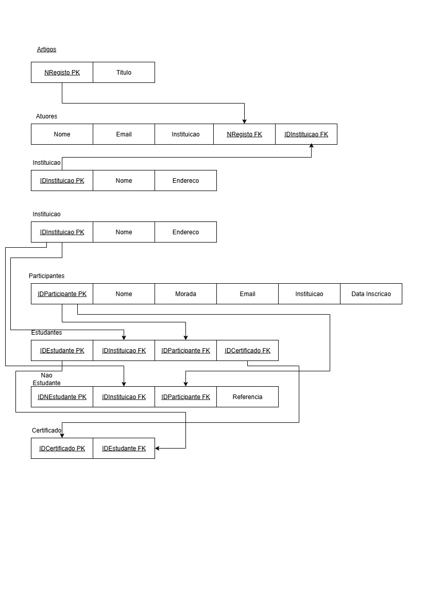
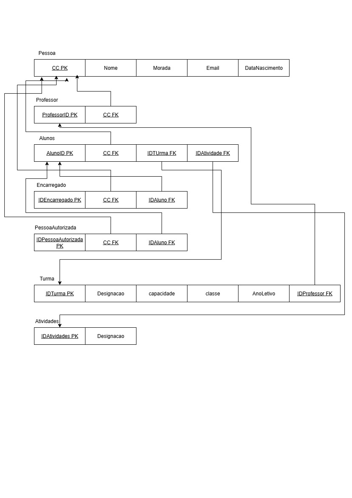

# BD: Guião 3


## ​Problema 3.1
 
### *a)*

```
... Write here your answer ...
. Quanto a relações e cardinalidades: 
- Cliente-Aluguer (1:N): 1 cliente pode ter N alugueres; cada aluguer tem 1 cliente.
- Balcão-Aluguer (1:N): 1 balcão pode registar N alugueres; cada aluguer tem 1 balcão.
- Veículo-Aluguer (1:N): 1 veículo pode ser alugado N vezes; cada aluguer refere-se á 1 veículo.
- Veículo-Aluguer (N:1): muitos veículos de um mesmo tipo.
- Tipo_Veículo quanto á similaridade (M:N): como há similaridade, cria-se uma tabela associativa.

. Esquema de Relação:
Cliente (NIF(PK), nome, endereco, num_carta);
Aluguer (numero_Aluguer(PK), duracao, data);
Balcao (numero_Balcao(PK), nome, endereco);
Veiculo (matricula(PK), marca, ano);
Tipo_Veiculo (codigo, designacao, arcondicionado);
Tipo_Similaridade (Tipo_A, TipoB);
Ligeiro (numLugares, portas, combustivel);
Pesado (peso, passageiros).

```


### *b)* 

```
... Write here your answer ...

```


### *c)* 




## ​Problema 3.2

### *a)*

```
... Write here your answer ...
```


### *b)* 

```
... Write here your answer ...
```


### *c)* 




## ​Problema 3.3


### *a)* 2.1



### *b)* 2.2



### *c)* 2.3



### *d)* 2.4

