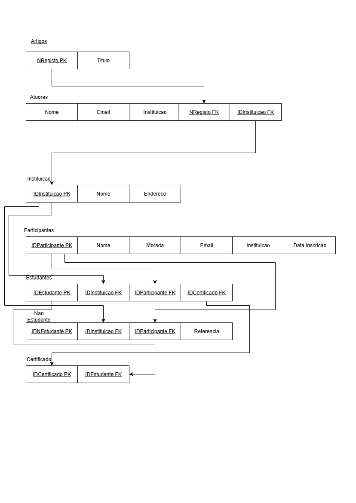

# BD: Guião 3


## ​Problema 3.1
 
### *a)*

```
... Write here your answer ...
. Quanto a relações e cardinalidades: 
- Cliente-Aluguer (1:N): 1 cliente pode ter N alugueres; cada aluguer tem 1 cliente.
- Balcão-Aluguer (1:N): 1 balcão pode registar N alugueres; cada aluguer tem 1 balcão.
- Veículo-Aluguer (1:N): 1 veículo pode ser alugado N vezes; cada aluguer refere-se á 1 veículo.
- Veículo-Aluguer (N:1): muitos veículos de um mesmo tipo.
- Tipo_Veículo quanto á similaridade (M:N): como há similaridade, cria-se uma tabela associativa.

. Esquema de Relação:
Cliente (NIF(PK), nome, endereco, num_carta);
Aluguer (numero_Aluguer(PK), duracao, data, NIF(FK), numero(FK), matricula(FK));
Balcao (numero_Balcao(PK), nome, endereco);
Veiculo (matricula(PK), marca, ano, codigo(FK));
Tipo_Veiculo (codigo, designacao, arcondicionado);
Tipo_Similaridade (Tipo_A, TipoB);
Ligeiro (numLugares, portas, combustivel, codigo(FK));
Pesado (peso, passageiros, codigo(FK)).

```


### *b)* 

```
... Write here your answer ...
. Chaves candidatas (CK):
- Cliente - NIF, num_carta;
- Aluguer - numero;
- Balcão - numero, endereco;
- Veiculo - matricula;
- Tipo_Veiculo - codigo.

. Chaves primárias (PK):
- Cliente - NIF;
- Aluguer - numero;
- Balcão - numero;
- Veiculo - matricula;
- Tipo_Veiculo - codigo.

. Chaves Estrangeiras (FK):
- Aluguer - NIF do cliente, numero do balcão, matrícula do veículo;
- Veículo - código do tipo_Veículo;
- Ligeiro - herda PK do Tipo_Veículo;
- Pesado - herda PK do Tipo_Veículo;
- Similarida de Tipo de Veículo: código de tipo de Veículo.

```


### *c)* 


## ​Problema 3.2

### *a)*

```
... Write here your answer ...
. Quanto a relações e cardinalidades: 


. Esquema de Relação:
AIRPORT (Airport_code(PK), City, State, Name);
CAN_LAND (Airport_code(FK), Type_name(FK));
AIRPLANE_TYPE (Type_name(PK), Company, Max_seats);
AIRPLANE (Airplane_ID(PK), Total_no_of_seats, Type_name(FK));
FLIGHT (Number(PK), Airline, Weekdays)
FARE (Code(PK), Amount, Restrictions, Number(FK));
FLIGHT_LEG (Leg_no(FK), Number(FK), Airport_Code(FK));
LEG_INSTANCE (Date(PK), Airport_Code(FK), Leg_no(FK), AirPlane_ID(FK))
SEAT (Seat_no(PK), Customar_name(FK))


```


### *b)* 

```
... Write here your answer ...
. Chaves candidatas (CK):
- AIRPORT - Airport_Code;
- AIRPLANE_TYPE - Type_name;
- AIRPLANE - AirPlane_ID;
- FLIGHT - Number;
- FLIGHT_LEG - Leg_no;
- LEG_INSTANCE - Date;
- FARE - Code;
- SEAT - Seat_no;
- RESERVATION -  Customer_ID, Cphone;
- CAN_LAND - AIRPORT.Airport_Code, AIRPLANE_TYPE.Type_name.

. Chaves primárias (PK):
- AIRPORT - Airport_Code;
- AIRPLANE_TYPE - Type_name;
- AIRPLANE - AirPlane_ID;
- FLIGHT - Number;
- FLIGHT_LEG - Leg_no;
- LEG_INSTANCE - Date;
- FARE - Code;
- SEAT - Seat_no;
- RESERVATION -  Customer_ID;

. Chaves Estrangeiras (FK):
- AIRPLANE - AIRPLANE_TYPE.Type_name;
- FLIGHT - Number;
- FLIGHT_LEG - FLIGHT.Number, AIRPORT.Airport_Code;
- LEG_INSTANCE - Date, AIRPORT.Airport_Code, FLIGHT_LEG.Leg_no, AIRPLANE.AirPlane_ID;
- FARE - Flight.Number;
- SEAT - LEG_INSTANCE.Date, RESERVATION.Customar_name;
- CAN_LAND - AIRPORT.Airport_Code, AIRPLANE_TYPE.Type_name.

```


### *c)* 


## ​Problema 3.3


### *a)* 2.1


### *b)* 2.2


### *c)* 2.3



### *d)* 2.4

